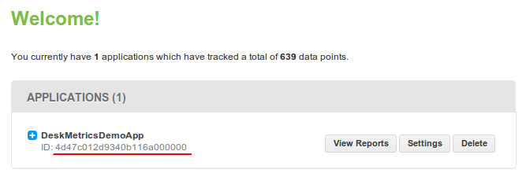
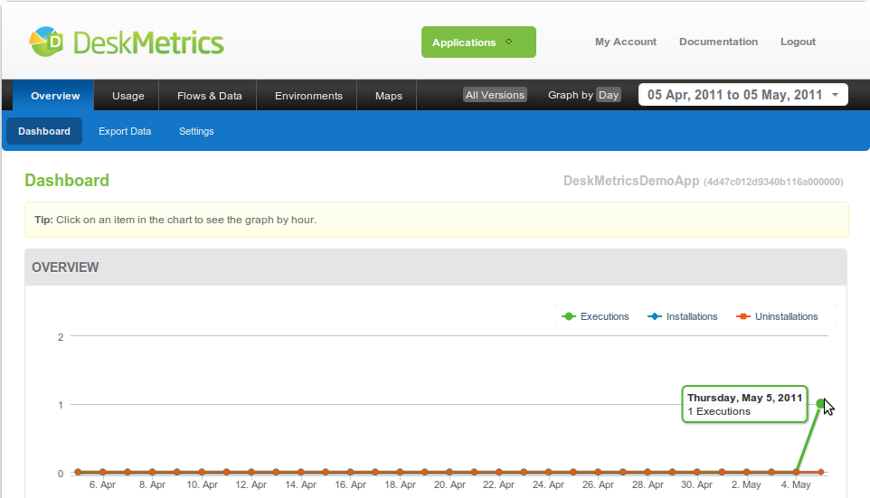
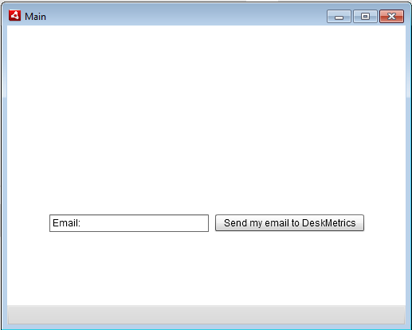

Integrating DeskMetrics into your Adobe Air application - The three minute version 
====================================================================================

In this tutorial, we'll show you how to use the DeskMetrics API for Adobe Air applications. Our API works well with Adobe Air 2.6 for Desktop applications in either Flex 3, 4 and 4.5. We will provide support for mobile applications with Adobe Air in few weeks. Stay tuned.

Are you ready for our three minute tutorial? 

1 - The first minute - Hello DeskMetrics
----------------------------------------

Hurry up! Create an Adobe Air blank application, `download our Adobe Air API <https://github.com/downloads/deskmetrics/FlexMetrics/DeskMetrics.swc>`_ and add reference to it in your project.

For this very first moment, we'll only add the 'DeskMetricsTracker.Start' and 'DeskMetricsTracker.Stop', the two required methods in DeskMetrics API. A very basic application skeleton should look like this:

.. code-block:: mxml 

    <?xml version="1.0" encoding="utf-8"?>
    <s:WindowedApplication xmlns:fx="http://ns.adobe.com/mxml/2009" 
                                               xmlns:s="library://ns.adobe.com/flex/spark" 
                                               xmlns:mx="library://ns.adobe.com/flex/mx"
                                               initialize="init()">
            <fx:Declarations>
                    <!-- Place non-visual elements (e.g., services, value objects) here -->
            </fx:Declarations>
            
            <fx:Script>
                    <![CDATA[
                            import com.DeskMetrics.DeskMetricsTracker;
                            
                            private function init():void
                            {
                                    DeskMetricsTracker.Start("your_app_id","1.0");
                                    NativeApplication.nativeApplication.autoExit = true;
                                    NativeApplication.nativeApplication.addEventListener(Event.EXITING,stop);
                            }
                            
                            private function stop(e:Event):void
                            {
                                    e.preventDefault();
                                    DeskMetricsTracker.Stop(function():void
                                    {
                                            NativeApplication.nativeApplication.removeEventListener(Event.EXITING,stop);
                                            NativeApplication.nativeApplication.exit(0);
                                    });
                            }

                    ]]>
            </fx:Script>
    </s:WindowedApplication>

Well, that's it. You only need to call 'DeskMetricsTracker.Start' when application starts and 'DeskMetricsTracker.Stop' when it finishes.

 .. warning:: 
    your app won't work if you don't call these two methods in order in your application

Where is my app id?
^^^^^^^^^^^^^^^^^^^

You need the app id for the Start method. This ID identifies your application on DeskMetrics Analytics. Go to http://analytics.deskmetrics.com/ and you'll see something like this:

  You can find this on DeskMetrics' Analytics page (http://analytics.deskmetrics.com/)

2 - Second minute: Running the app and checking the results.
-------------------------------------------------------------

Those two methods are more useful than you may think. Try to run your application and then open its dashborad at http://analytics.deskmetrics.com/  and see what happens (**Note**: you'll need to start **and** stop your application before you check the dashboard).

After the first run and after you've closed your application, you can see the data on the Analytics: 

  
  Mission complete, your first integration was done! You can see this data on your application's Dashboard

3 - Third minute - Adding some event tracking 
----------------------------------------------

DeskMetrics provide a full-featured framework for you track any user action inside your software. Wanna know how much time an user takes to fill a form? No problem,just use the *TrackEventTimed* method. Do you wanna know how many times a specific button got clicked? No problem, just use the *TrackEvent* method and you'll be done. In our sample app, we can do something like this:

    Our first Adobe Air app tracked with DeskMetrics. 

4 - What is next?
-----------------

We hope that this basic tutorial was useful to you. If you missed something, you can :download:`download the entire project <doc_static/DeskMetricsAirDemoApp.zip>` and make the things works by yourself :-) 

Also, don't forget to look the complete :doc:`DeskMetrics API documentation for Air <AdobeAir_API>`

