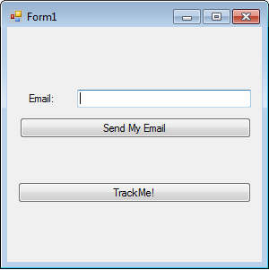

Integrating DeskMetrics into your C# application - The three minute version
============================================================================

This short tutorial will guide you through the basics of our API for C# applications. The examples are made using Visual Studio 2010, but it works well with Monodevelop running under Linux and MacOSX.

Don't forget to check the :doc:`Complete DeskMetrics C# API reference <CSharp_API>`.

Be prepared...

1 - The first minute - Hello, DeskMetrics! 
-----------------------------------------------

We don't have much time. Create a Windows Form project and add the reference for our assembly (https://github.com/downloads/deskmetrics/DeskMetrics.NET/DeskMetrics.dll) 

This code talk by itself:

.. code-block:: csharp

    using System;
    using System.Collections.Generic;
    using System.ComponentModel;
    using System.Data;
    using System.Drawing;
    using System.Linq;
    using System.Text;
    using System.Windows.Forms;

    using DeskMetrics;

    namespace DeskMetricsDemoApp
    {
        public partial class Form1 : Form
        {
            //DeskMetrics.Watcher
            Watcher watcher = new Watcher();
            public Form1()
            {
                InitializeComponent();
            }

            private void Form1_Load(object sender, EventArgs e)
            {
                //you **need** to call the Start method
                //see below how to get the app id
                watcher.Start("your_app_id", "1.0");
            }

            private void Form1_FormClosing(object sender, FormClosingEventArgs e)
            {
                //you **need** to call the Stop method
                watcher.Stop();
            }
        }
    }

The two methods call (Start and Stop) **are mandatory**. The *Start* method is responsible for the machine information gathering (like OS, plugins and VMs, hardware, etc)  and the *Stop* method  will send the gathered data to DeskMetrics Analytics.

 .. warning:: 
    your app won't work if you don't call these two methods in order in your application

Where is my app id?
^^^^^^^^^^^^^^^^^^^

You need the app id for the Start method. This ID identifies your application on DeskMetrics Analytics. Go to http://analytics.deskmetrics.com/ and you'll see something like this:

.. figure:: doc_static/app_id.png
  :alt: Showing where you can get the application ID 

  You can find this on DeskMetrics' Analytics page (http://analytics.deskmetrics.com/)

2 - Second minute - Running the app and checking the results
--------------------------------------------------------------

Just run the app and closes it in sequence. Yeah, it will be an empty form, but it is enough to you to see the difference it makes on your DeskMetrics' Analytics.

After the first run and after you've closed your application, you can see the data on the Analytics: 

.. figure:: doc_static/first_run.png
  :alt: Mission complete, your first integration was done!  
  
  Mission complete, your first integration was done! You can see this data on your application's Dashboard

3 - Third minute - Adding some event tracking 
----------------------------------------------

DeskMetrics provide a full-featured framework for you track any user action inside your software. Wanna know how much time an user takes to fill a form? No problem,just use the *TrackEventTimed* method. Do you wanna know how many times a specific button got clicked? No problem, just use the *TrackEvent* method and you'll be done. In our sample app, we can do something like this:

    Our first .NET app tracked with DeskMetrics. 

Just add those controls on your form. Our code will look like this:

.. code-block:: csharp

    using System;
    using System.Collections.Generic;
    using System.ComponentModel;
    using System.Data;
    using System.Drawing;
    using System.Linq;
    using System.Text;
    using System.Windows.Forms;
    using DeskMetrics;

    namespace DeskMetricsDemoApp
    {
        public partial class Form1 : Form
        {
            Watcher watcher = new Watcher();
            public Form1()
            {
                InitializeComponent();
            }

            private void Form1_Load(object sender, EventArgs e)
            {
                watcher.Start("your_app_id", "1.0");
            }

            private void Form1_FormClosing(object sender, FormClosingEventArgs e)
            {
                watcher.Stop();
            }

            private void button1_Click(object sender, EventArgs e)
            {
                watcher.TrackEvent("ButtonClick", "TrackMe");
            }

            private void button2_Click(object sender, EventArgs e)
            {
                watcher.TrackCustomData("UserEmail", textBox1.Text);
            }
        }
    }

In this example, we track an button click and we send the user email address to our analytics as a *custom data*. If you wanna track anything that DeskMetrics doesn't provide default way, you can track it as a *custom data*. You can even track custom data in real time, using the *TrackCustomDataR* method.  There is a lot of cool stuff available on DeskMetrics :-)

4 - What is next?
------------------

We hope that this basic tutorial was useful to you. If you missed something, you can :download:`download the entire project <doc_static/DeskMetricsDemoApp.zip>` and make the things works by yourself :-) 

Also, don't forget to check the :doc:`Complete DeskMetrics C# API reference <CSharp_API>`.
