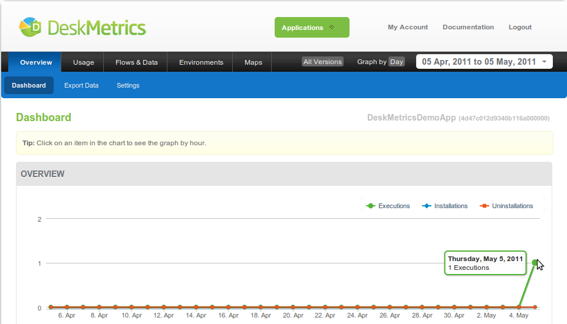

Integrating DeskMetrics into your Delphi application - The three minute version
==================================================================================

This short tutorial will guide you through the basics of our API for Delphi applications. The examples are made using Delphi 2009, but it should work well with previous versions of Delphi IDE.

Don't forget to check the :doc:`Complete DeskMetrics Delphi API reference <Delphi_API>`.

Are you ready?

1 - The first minute - Hello DeskMetrics!
------------------------------------------

This first step is very basic stuff. As any other dependency, you need to `download the DeskMetrics package <https://github.com/deskmetrics/DelphiMetrics/zipball/1.7.0.0>`_, add the file under `Integration Units/Dephi/DeskMetrics.pas` to your project. After that, you need to put the DeskMetrics.dll file into your PATH (usually, the developers place this dll inside their c:\windows\system32 folder or at the same directory as the application executable).

After that, you need to add three lines of code inside your application in order to add very basic tracking:

.. code-block:: pascal

    //the DeskMetrics library
    uses DeskMetrics;

    procedure TForm1.FormCreate(Sender: TObject);
    begin
      //initializes your application
      DeskMetricsStart('YOUR APPLICATION ID', '1.0');
    end;

    procedure TForm1.FormClose(Sender: TObject; var Action: TCloseAction);
    begin
       Self.Visible := False;
       //finalizes the application and send the collected data to DeskMetrics
       DeskMetricsStop;
    end;

The two methods call (DeskMetricsStart and DeskMetricsStop) **are mandatory**. The *DeskMetricsStart* method is responsible for the machine information gathering (like OS, plugins and VMs, hardware, etc) and the *DeskMetricsStop* method  will send the gathered data to DeskMetrics Analytics.

 .. warning:: 
    your app won't work if you don't call these two methods in order in your application

Where is my app id?
^^^^^^^^^^^^^^^^^^^

You need the app id for the Start method. This ID identifies your application on DeskMetrics Analytics. Go to http://analytics.deskmetrics.com/ and you'll see something like this:

.. figure:: doc_static/app_id.png
  :alt: Showing where you can get the application ID 

  You can find this on DeskMetrics' Analytics page (http://analytics.deskmetrics.com/)

2 - Second minute: Running the app and checking the results.
-------------------------------------------------------------

Those two methods are more useful than you may think. Try to run your application and then open its dashboard at http://analytics.deskmetrics.com/  and see what happens (**Note**: you'll need to start **and** stop your application before you check the dashboard).

After the first run and after you've closed your application, you can see the data on the Analytics: 

  
  Mission complete, your first integration was done! You can see this data on your application's Dashboard

3 - Third minute - Adding some event tracking 
----------------------------------------------

By now, we've just added some very basic app tracking. You can track more meaningful user information, like event tracking. For example, you can add a button to your application and track its click like we show below:

.. code-block:: pascal

    //the DeskMetrics library
    uses DeskMetrics;

    procedure TForm1.FormCreate(Sender: TObject);
    begin
      //initializes your application
      DeskMetricsStart('YOUR APPLICATION ID', '1.0');
    end;

    procedure TForm1.FormClose(Sender: TObject; var Action: TCloseAction);
    begin
       Self.Visible := False;
       //finalizes the application and send the collected data to DeskMetrics
       DeskMetricsStop;
    end;

     procedure TForm2.Button1Click(Sender: TObject);
     begin
       //tracks a button click event
       DeskMetricsTrackEvent('ButtonClick','Button1')
     end;   

4 - What is next?
------------------

This tutorial showed very basic DeskMetrics features. We recommend you read :doc:`the complete API reference <Delphi_API>` in order to use all features DeskMetrics provide. 
