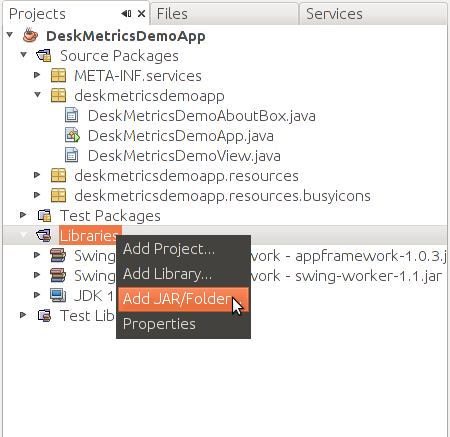

Integrating DeskMetrics into your Java application - The three minute version
==============================================================================

This short tutorial will guide you through the basics of our API for Java applications. In this tutorial, we're using NetBeans 6.9 under Ubuntu Linux 10.10 and Java 1.6.0_20.

Are you ready?

1 - First minute - Hello DeskMetrics.
-------------------------------------

This first step is pretty basic stuff. We'll create a "Java Application" project under Netbeans. Call it "DeskMetricsDemoApp" just for the sake of convention.

After the project was created, add the DeskMetrics' jar as a project library. To do so, download our jar (https://github.com/downloads/deskmetrics/jDeskMetrics/jDeskMetrics.jar), and add it to your app by right-clicking Libraries and selecting the **Add Jar/Folder** option, just like the image below:

Most of the code we're showing below is just Java's boilerplate. Skipping to the important part, you just need to call *deskmetrics.start* and *deskmetrics.stop* to for your app start working with minimal features.  **Note: you'll need more than start and stop methods to track all events you want on your application. Continue the reading :-)**

.. code-block:: java

        package DeskMetricsDemoApp;

        import com.DeskMetrics.DeskMetrics;
        import java.awt.Dimension;
        import java.awt.event.WindowAdapter;
        import java.awt.event.WindowEvent;
        import java.io.IOException;

        import javax.swing.JFrame;

        public class Main extends JFrame {
            public static void main(String[] args) throws IOException {
                Main frame = new Main();
                frame.setSize(new Dimension(200, 200));
                frame.setTitle("DeskMetrics DemoApp");

                final DeskMetrics deskmetrics = DeskMetrics.getInstance();
                String appID = "put_your_app_id_here";

                deskmetrics.start(appID, "0.5");
                
                frame.addWindowListener(new WindowAdapter() {

                    @Override
                    public void windowClosing(WindowEvent e) {
                        try {
                            deskmetrics.stop();
                            System.out.println("Application finished");
                        } catch (IOException ex) {
                            System.out.println("Failed to finish the application correctly.");
                        }
                        System.exit(0);
                    }
                });
                
                frame.setVisible(true);
            }
        }

The two methods call (Start and Stop) **are mandatory**. The *Start* method is responsible for the machine information gathering (like OS, plugins and VMs, hardware, etc)  and the *Stop* method  will send the gathered data to DeskMetrics Analytics.

 .. warning:: 
    your app won't work if you don't call these two methods in order in your application

Where is my app id?
^^^^^^^^^^^^^^^^^^^

You need the app id for the Start method. This ID identifies your application on DeskMetrics Analytics. Go to http://analytics.deskmetrics.com/ and you'll see something like this:

.. figure:: doc_static/app_id.png
  :alt: Showing where you can get the application ID 

  You can find this on DeskMetrics' Analytics page (http://analytics.deskmetrics.com/)

2 - Second minute - Running the app and ckecking the results
------------------------------------------------------------

Just run the app and closes it in sequence. Yeah, it will be an empty form, but it is enough to you to see the difference it makes on your DeskMetrics' Analytics.

After the first run and after you've closed your application, you can see the data on the Analytics: 

.. figure:: doc_static/first_run.png
  :alt: Mission complete, your first integration was done!  
  
  Mission complete, your first integration was done! You can see this data on your application's Dashboard

3 - Third minute - Adding some event tracking 
----------------------------------------------

What we've done so far was just simple experiments on how DeskMetrics works. In order to produce a more useful application, you'll need more than just tracks its starts and stop events. We extended the previous example to show you more about DeskMetrics' features:

.. code-block:: java

        package com.DeskMetrics.IntegrationTests;

        import com.DeskMetrics.DeskMetrics;
        import java.awt.Dimension;
        import java.awt.event.MouseAdapter;
        import java.awt.event.MouseEvent;
        import java.awt.event.WindowAdapter;
        import java.awt.event.WindowEvent;
        import java.io.IOException;
        import javax.swing.JButton;

        import javax.swing.JFrame;

        public class Main extends JFrame {
            public static void main(String[] args) throws IOException {
                Main frame = new Main();
                frame.setSize(new Dimension(200, 200));
                frame.setTitle("DeskMetrics DemoApp");

                final DeskMetrics deskmetrics = DeskMetrics.getInstance();
                String appID = "put_your_app_id_here";

                deskmetrics.start(appID, "0.5");

                frame.addWindowListener(new WindowAdapter() {

                    @Override
                    public void windowClosing(WindowEvent e) {
                        try {
                            deskmetrics.stop();
                            System.out.println("Application finished");
                        } catch (IOException ex) {
                            System.out.println("Failed to finish the application correctly.");
                        }
                        System.exit(0);
                    }
                });

                //add a button and a simple event tracking to it
                JButton button = new JButton();
                button.setText("Click me!");
                button.addMouseListener(new MouseAdapter() {
                    @Override
                    public void mouseClicked(MouseEvent e) {
                        deskmetrics.trackEvent("ButtonClick", "ClickMe");
                    }
                });
                frame.add(button);
                
                frame.setVisible(true);
            }
        }

We've just added a button and we used the *trackEvent* method to track it. If you run it and click the button, you'll see the event showing up on `DeskMetrics Analytics <http://analytics.deskmetrics.com/>`_. There is a lot of other kinds of information you can track. We recommend you to read the :doc:`complete DeskMetrics' Java API <Java_API>` in order to know more about you can do with DeskMetrics.

4 - What is next?
-----------------

We hope that this basic tutorial was useful to you. If you missed something, you can :download:`download the entire project <doc_static/jDeskMetricsDemoApp.zip>` and make the things works by yourself :-) 

By now, you already have knowledge on DeskMetrics platform. If you wanna know more, we recommend you to read the :doc:`complete DeskMetrics' Java API <Java_API>`.
